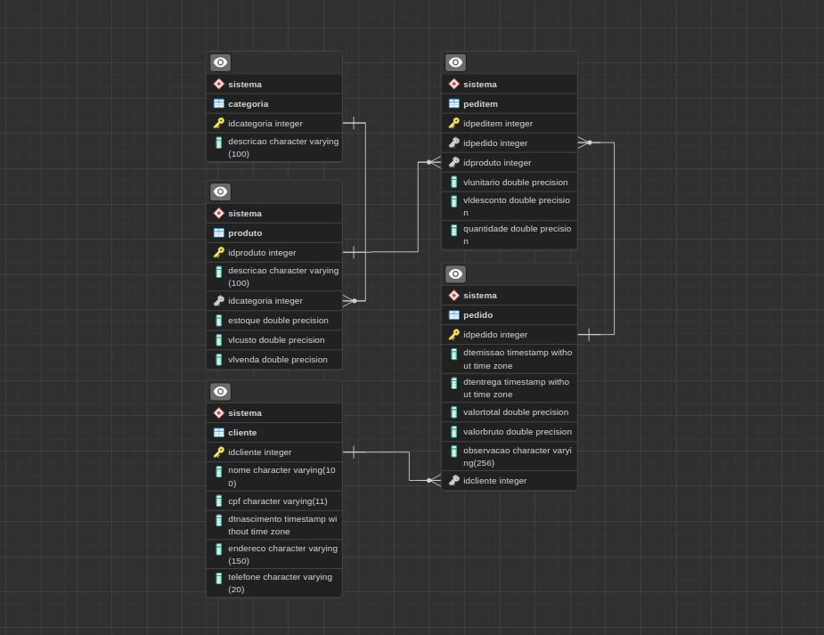

<h1 style="color: #922224" align="center">Serratec Trabalho Final POO</h1>
<h4 style="color: #922224" align="center">Serratec OOP Final Project</h4>

This project was the final project for the OOP discipline in the FullStack course from Serratec. Our team worked together to create a complete CRUD application with all database processes, including configuring PostgreSQL, using JDBC, and connecting with the database.

The program simulates a sales software where you can create, update, and delete orders. The product stock is updated after creating, updating, or removing an order, based on the ordered products. Although it is a console program, it has a user-friendly interface.

• Database relationships 
• JDBC connection configuration with PostgreSQL 
• CRUD algorithms 
• DAO structure 
• Clean code principles/patterns 

